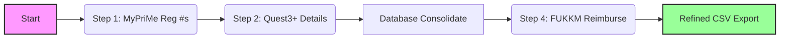
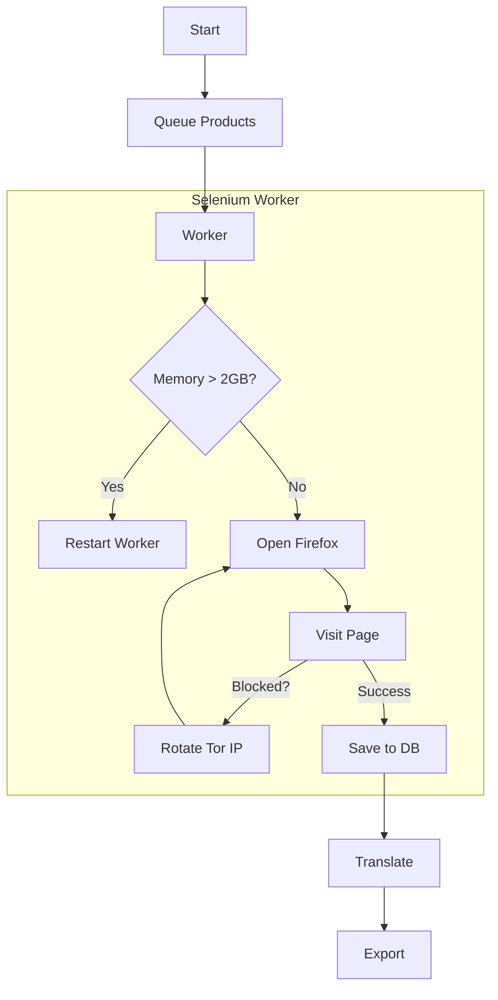

# Paper Banana: Malaysia & Argentina Scraper Documentation

> [!NOTE]
> This document provides a comprehensive overview of the Malaysia and Argentina pharmaceutical data scrapers. It covers both non-technical workflows and deep technical architecture details.

---

# 1. Malaysia Scraper

## Non-Technical Overview
The Malaysia Scraper is a fully automated system designed to collect pharmaceutical product registration and pricing data from Malaysian government sources. It builds a comprehensive database of registered medicines, including their active ingredients, holders, and reimbursement status.

### Key Outputs
- **Product List**: granular details on all registered pharmaceutical products.
- **Reimbursement Data**: Information on which drugs are fully reimbursable by the government.
- **PCID Mapping**: A unified export linking products to a standard "Product Company ID" for downstream integration.

### Workflow
1.  **Registration**: The robot first visits the *MyPriMe* portal to download the master list of all registered product numbers.
2.  **Detail Extraction**: Using the list from step 1, it visits the *Quest3+* system to extract detailed product leaflets and specifications.
3.  **Consolidation**: Data from multiple sources is merged into a central database.
4.  **Reimbursement Check**: It cross-references products with the *FUKKM* (Ministry of Health) list to identify reimbursable items.
5.  **Export**: Final clean CSV files are generated for the business.
     
---

## Technical Architecture

### Stack
-   **Language**: Python 3.10+
-   **Browser Engine**: Playwright (for reliable handling of modern dynamic web/JS apps)
-   **Database**: PostgreSQL (handling large datasets and complex relationships)
-   **Infrastructure**: Windows Server

### Pipeline Phases
The scraper runs as a sequential pipeline (`run_pipeline_resume.py`) with state management.

| Step | Script | Description |
| :--- | :--- | :--- |
| **0** | `step_00_backup_clean.py` | Archives previous run data and initializes DB tables. |
| **1** | `step_01_registration.py` | Uses **Playwright** to scrape *MyPriMe*. Captures traffic to internal APIs to get raw JSON data. |
| **2** | `step_02_product_details.py` | Scrapes *Quest3+*. This is the heaviest step. It iterates through the registration numbers found in Step 1. |
| **3** | `step_03_consolidate.py` | SQL-heavy step that merges raw JSON data into structured relational tables (`my_product_main`, etc.). |
| **4** | `step_04_reimbursable.py` | Scrapes the *FUKKM* portal for pricing and reimbursement status. |
| **5** | `step_05_pcid_export.py` | Generates final CSVs mapping Local IDs to Global PCIDs. |

### Key Features
-   **Resume Capability**: The `PipelineCheckpointManager` allows the scraper to be stopped and resumed from the last successful step. Do not need to restart from zero if Step 4 fails.
-   **Smart Locators**: Uses a centralized `smart_locator.py` strategy to handle changing CSS selectors on government sites.
-   **Metrics**: Integrated with Prometheus for real-time dashboarding (Step duration, items scraped, error rates).

---

# 2. Argentina Scraper

## Non-Technical Overview
The Argentina Scraper targets the *AlfaBeta* platform to extract high-fidelity pricing and catalog data for the Argentine pharmaceutical market. Because the target site is heavily protected against bots, this scraper mimics human behavior using advanced "stealth" techniques.

### Key Outputs
- **Price List**: Up-to-date market prices for medicines.
- **Catalog**: Complete list of presentations (box sizes, strengths) for every brand.
- **Images**: Product packaging photos (where available).

### Workflow
1.  **Catalog Discovery**: It starts by building a list of all known products and companies.
2.  **Stealth Scraping**: The robot opens a web browser (Firefox) and searches for each product one by one, mimicking a human user to avoid detection.
3.  **Rotation**: To avoid getting "banned" (blocked), the robot constantly changes its "digital fingerprint" (IP address, browser version).
4.  **Translation**: Spanish terms are automatically translated to standard English medical terminology.
5.  **Validation**: A rigorous quality check ensures no "ghost" products (no price, no data) make it to the final report.

---

## Technical Architecture

### Stack
-   **Language**: Python 3.10+
-   **Browser Engine**: Selenium with **Firefox (Geckodriver)**
-   **Network**: **Tor** (The Onion Router) & **Surfshark VPN** for IP rotation.
-   **Database**: PostgreSQL

### Advanced Anti-Detection System
The Argentina scraper (`03_alfabeta_selenium_worker.py`) is technically superior in its evasion capabilities:

1.  **IP Rotation Strategy**:
    *   **Tor Integration**: Uses the Tor control port to signal `NEWNYM`, forcing a fresh exit node (IP address) every few minutes.
    *   **VPN Integration**: Can trigger system-level VPN rotations via Surfshark CLI command if configured.
2.  **Fingerprint Rotation**:
    *   Rotates `User-Agent` strings (browser versions).
    *   Randomizes Viewport resolution (screen size).
    *   Randomizes Timezone.
3.  **Resource Management**:
    *   **Memory Guard**: Monitors RAM usage. If the browser consumes >2GB, it performs a "Nuclear Cleanup" (kills all processes) and restarts the worker to prevent crashes.
    *   **Browser Isolation**: Profiling system creates unique temporary Firefox profiles for each session to prevent cookie/tracker cross-contamination.

### Pipeline Phases

| Step | Script | Description |
| :--- | :--- | :--- |
| **0-2** | `01_getProdList` / `02_prepare` | Prepares the "Frontier" (queue of URLs to visit). |
| **3** | `03_alfabeta_selenium_worker` | **The Core**. Multi-threaded Selenium workers visiting product pages. Handles captchas and blocks by rotating IPs. |
| **5** | `04_alfabeta_api_scraper` | Optional/Fallback step to use their mobile API if the web scraper is blocked. |
| **6** | `05_Translate` | Dictionary-based translation of Spanish forms/routes to English. |
| **8** | Recovery Rows | Automatically retries items that returned "No Data" in the first pass. |

---

# Summary Comparison

| Feature | Malaysia | Argentina |
| :--- | :--- | :--- |
| **Scraping Difficulty** | Medium (Dynamic JS) | **Extreme** (Active blocking) |
| **Browser Engine** | Playwright (Fast/Modern) | Selenium + Firefox (Stealth) |
| **IP Rotation** | Standard | **Tor + VPN + Fingerprinting** |
| **Concurrency** | Sequential Steps | Parallel Workers |
| **Primary Challenge** | Complex data parsing (Quest3+) | Evasion & Stability |
